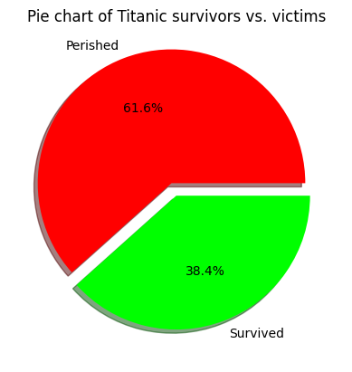
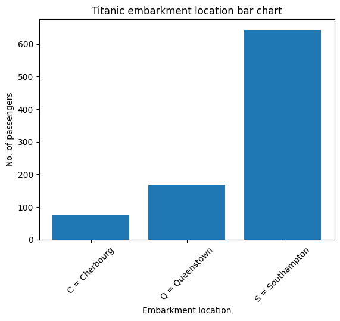

# Exploratory Data Analysis (EDA)

## Visualisasi Data

Visualisasi data adalah tindakan untuk mendapatkan gambaran mengenai data
dengan menggunakan piranti lunak.
Piranti lunak yang sering digunakan untuk melakukan visualisasi data yaitu
Python dan Jupyter Notebook.
Python memudahkan seorang analis data dalam melakukan pekerjaannya karena
sifatnya yang mudah untuk dibaca dan di-program. Selain itu, pilihan
_library_ yang luas juga menjadi daya tarik tambahan.

_Library-library_ yang seringkali digunakan untuk melakukan visualisasi
data yaitu _pandas_, _numpy_, _scipy_, _matplotlib_, dan _seaborn_.
_Library pandas_ menyediakan fitur _data frame_ yang bisa menampung dan
melakukan operasi-operasi kepada data yang ditampung di dalamnya.
_Library numpy_ dan _scipy_ menyediakan fitur-fitur matematika yang banyak digunakan
oleh _library library_ lainnya.
_Library matplotlib_ menyediakan fitur-fitur untuk menggambarkan grafik
dan plot data yang bisa mengubah tampilan data menjadi berbentuk visual.
_Library seaborn_ menjadi pelengkap dari _library matplotlib_ dengan
menyediakan fitur-fitur visualisasi yang lebih canggih dan indah.

Jupyter Notebook adalah piranti lunak yang menjadi _environment_ dilakukannya
proses analisis data. Di dalamnya, analis data dapat menuliskan kode dan
proses-proses analisis data. Kode dan fungsi program dipisahkan ke dalam
sel-sel yang dapat dijalankan secara independen maupun sekuensial. Salah
satu platform online yang menyediakan Jupyter Notebook adalah Google Colab.

### Dataset

Dataset adalah kumpulan data/fakta yang digunakan dalam proses analisis data.
Pada penjelasan EDA kali ini, dataset yang digunakan adalah dataset publik
yaitu Titanic Disaster. Dataset ini dapat diakses melalui tautan
[Titanic Kaggle](https://www.kaggle.com/competitions/titanic/data)
atau melalui tautan
[Titanic GitHub](https://github.com/datasciencedojo/datasets/blob/master/titanic.csv).

Pada bagian-bagian selanjutnya, akan dilakukan visualisasi data dengan beragam
teknik untuk mendapatkan _insight_ yang terkandung dalam dataset Titanic
Disaster tersebut.

### Teknik Visualisasi Data

Visualisasi dapat dilakukan dengan menggunakan teknik-teknik/metode visualisasi
seperti, tapi tidak terbatas pada, teknik-teknik di bawah ini:

- Diagram pie
- Diagram batang
- Diagram garis
- _Scatter plot_
- _Heatmap_
- _Histogram_
- _Correlation_
- _Descriptive Statistics_
- _Grouping (Pivot)_
- ANOVA

#### Diagram Pie

Diagram pie adalah diagram yang digunakan untuk menampilkan proporsi jumlah
dari setiap kategori dalam dataset dibandingkan keseluruhan data dalam bentuk
lingkaran.

Berikut adalah contoh diagram pie yang menunjukkan proporsi penumpang selamat
dan penumpang meninggal dunia.

```py
import pandas as pd
import matplotlib.pyplot as plt

# Load Titanic dataset
# Example dataset URL (replace with actual dataset path if using local file)
url = 'https://raw.githubusercontent.com/datasciencedojo/datasets/master/titanic.csv'
df = pd.read_csv(url)

survival = df['Survived'].value_counts()
plt.title('Pie chart of Titanic survivors vs. victims')
plt.pie(
    survival.values,
    labels=('Perished', 'Survived'),
    autopct='%1.1f%%',
    colors=('#FF0000', '#00FF00'),
    explode=(0.1, 0),
    shadow=True
)
plt.show()
```



#### Diagram Batang

Diagram batang adalah diagram yang digunakan untuk menampilkan dan
membandingkan data kategorikal dalam dataset dalam bentuk batangan.
Diagram batang bisa menampilkan lebih banyak kategori data dibandingkan
dengan diagram pie.

Berikut adalah contoh diagram batang yang menunjukkan jumlah penumpang
berdasarkan lokasi keberangkatan penumpang.

```py
import pandas as pd
import matplotlib.pyplot as plt
import numpy as np

# Load Titanic dataset
# Example dataset URL (replace with actual dataset path if using local file)
url = 'https://raw.githubusercontent.com/datasciencedojo/datasets/master/titanic.csv'
df = pd.read_csv(url)

embarkment = df['Embarked'].value_counts()
embarkment.sort_values(inplace=True)

x_coords = np.arange(len(embarkment))

plt.bar(
    x_coords,
    embarkment,
    tick_label=('C = Cherbourg', 'Q = Queenstown', 'S = Southampton')
)
plt.xticks(rotation=45)
plt.ylabel('No. of passengers')
plt.xlabel('Embarkment location')
plt.title('Titanic embarkment location bar chart')
plt.show()
```



#### Diagram Garis

Diagram garis adalah diagram yang digunakan untuk menampilkan kemajuan data
dalam rentang tertentu, dengan menampilkan titik-titik yang dihubungkan
dengan garis antara satu dengan yang lainnya.

Berikut adalah contoh diagram garis yang menunjukkan kemajuan/trend
tingkat keselamatan penumpang berdasarkan rentang umur.

```py
import pandas as pd
import matplotlib.pyplot as plt

# Load Titanic dataset
# Example dataset URL (replace with actual dataset path if using local file)
url = 'https://raw.githubusercontent.com/datasciencedojo/datasets/master/titanic.csv'
df = pd.read_csv(url)

# Create age bins
bins = [0, 5, 10, 15, 20, 30, 40, 50, 60, 70, 80]
labels = ['0-5', '6-10', '11-15', '16-20', '21-30', '31-40', '41-50', '51-60', '61-70', '71-80']
df['AgeGroup'] = pd.cut(df['Age'], bins=bins, labels=labels, right=False)

# Calculate survival rates by age group
age_group_survival = df.groupby('AgeGroup')['Survived'].mean()

# Plotting
plt.figure(figsize=(10, 6))
plt.plot(age_group_survival.index, age_group_survival.values, marker='o', linestyle='-', color='b')
plt.title('Titanic survival rate by age group')
plt.xlabel('Age Group')
plt.ylabel('Survival Rate')
plt.grid(True)
plt.show()
```


#### _Scatter Plot_

_Scatter plot_ adalah bagan yang bisa memberikan informasi pola maupun pencilan
dalam dataset dengan menggunakan dua komponen numerik dalam dataset.

Berikut adalah contoh _scatter plot_ yang menggambarkan poin-poin data dengan
karakteristik yaitu dua komponen numerik umur dan tarif, dengan warna
yang mewakili keselamatan penumpang tersebut.

```py
import pandas as pd
import matplotlib.pyplot as plt

# Load Titanic dataset
url = 'https://raw.githubusercontent.com/datasciencedojo/datasets/master/titanic.csv'
df = pd.read_csv(url)

# Scatter plot of Age vs Fare
plt.figure(figsize=(10, 6))
plt.scatter(df['Age'], df['Fare'], alpha=0.5, c=df['Survived'], cmap='viridis', edgecolor='k', s=50)
plt.title('Titanic age vs fare scatter plot')
plt.xlabel('Age')
plt.ylabel('Fare')
plt.colorbar(label='Survived')
plt.grid(True)
plt.show()
```


#### _Heatmap_

_Heatmap_ adalah teknik visualisasi yang menggunakan pewarnaan untuk mewakili
nilai atau kepadatan relatif data di dataset. Warna-warna yang ditampilkan
dalam _heatmap_ dapat digunakan untuk mencari kelompok-kelompok data yang
punya hubungan dan mendeteksi trend dalam data.

Berikut adalah contoh _heatmap_ yang menggambarkan hubungan korelasi antar
kolom numerik dataset.

```py
import pandas as pd
import seaborn as sns
import matplotlib.pyplot as plt

# Load Titanic dataset
url = 'https://raw.githubusercontent.com/datasciencedojo/datasets/master/titanic.csv'
df = pd.read_csv(url)
df.drop('Name', axis=1, inplace=True)
df.drop('Sex', axis=1, inplace=True)
df.drop('Cabin', axis=1, inplace=True)
df.drop('Ticket', axis=1, inplace=True)
df.drop('Embarked', axis=1, inplace=True)

# Compute the correlation matrix
corr = df.corr()

# Create a heatmap
plt.figure(figsize=(8, 6))
sns.heatmap(corr, annot=True, cmap='coolwarm', vmin=-1, vmax=1, center=0)
plt.title('Titanic Correlation Matrix Heatmap')
plt.show()
```


#### _Histogram_

_Histogram_ adalah teknik visualisasi yang digunakan untuk memahami distribusi
dari dataset. Nilai yang disampaikan oleh teknik ini adalah jumlah dari
kemunculan suatu nilai dalam data. Seringkali nilai tersebut dimasukkan
ke dalam _bin_ atau kelompok-kelompok agar bagan yang dihasilkan lebih mudah
dipahami.

Berikut adalah contoh _histogram_ yang menunjukkan frekuensi / jumlah
penumpang dengan umur pada rentang-rentang usia yang ditentukan.

```py
import pandas as pd
import matplotlib.pyplot as plt

# Load Titanic dataset
url = 'https://raw.githubusercontent.com/datasciencedojo/datasets/master/titanic.csv'
df = pd.read_csv(url)

# Extract age data
ages = df['Age'].dropna()  # Drop missing values for age

# Create histogram
plt.figure(figsize=(10, 6))
plt.hist(ages, bins=30, edgecolor='black', alpha=0.7)
plt.title('Histogram of Titanic passenger ages')
plt.xlabel('Age')
plt.ylabel('Frequency')
plt.grid(False)
plt.show()
```


#### _Correlation_

_Correlation_ adalah sebuah ukuran ketergantungan antara variabel. _Causation_
adalah hubungan sebab-akibat antara dua variabel. _Correlation_ tidak
mendeskripsikan sebab-akibat dalam dataset. Menentukan _causation_ lebih
sulit dibandingkan dengan menentukan _correlation_, karena membutuhkan
analisis lebih lanjut.

Pada _method_ `corr` pada _library pandas_, metode yang digunakan adalah
_Pearson correlation_. _Pearson correlation_ dapat menentukan korelasi linier
antara dua variabel. Nilai p-value dapat digunakan untuk menentukan signifikansi
statistik dari nilai korelasi yang didapat. Contoh: tingkat signifikansi 0,05
menandakan bahwa 95% korelasi antar variabel adalah signifikan secara statistik.

Konvensi umum mengenai nilai p-value adalah sebagai berikut:

- nilai p adalah $\le$ 0,001: kami katakan ada bukti kuat bahwa korelasinya signifikan.
- nilai p adalah $\le$ 0,05: terdapat bukti moderat bahwa korelasi tersebut signifikan.
- nilai p adalah $\le$ 0,1: ada bukti lemah bahwa korelasinya signifikan.
- nilai p adalah $\gt$ 0,1: tidak ada bukti bahwa korelasi tersebut signifikan.

Berikut adalah contoh penghitungan _correlation_ antara variabel dalam dataset.
Variabel yang dengan korelasi tertinggi adalah Parch vs. SibSp dengan nilai
korelasi 0.55.

```py
import pandas as pd
import seaborn as sns
import matplotlib.pyplot as plt

# Load Titanic dataset
url = 'https://raw.githubusercontent.com/datasciencedojo/datasets/master/titanic.csv'
df = pd.read_csv(url)

# Compute the correlation matrix
corr = df[['Age', 'Fare', 'Pclass', 'SibSp', 'Parch', 'Survived']].corr()

# Find the most correlated pair
# Drop diagonal values by setting them to NaN
corr_no_diag = corr.copy()
for i in range(len(corr_no_diag)):
    corr_no_diag.iloc[i, i] = None

# Find the maximum correlation value and its indices
max_corr = corr_no_diag.abs().max().max()
max_corr_pair = corr_no_diag.stack().idxmax()

print(f"Most correlated variables: {max_corr_pair} with a correlation of {max_corr:.2f}")

# Create regression plot for the most correlated pair
x_var, y_var = max_corr_pair

plt.figure(figsize=(10, 6))
sns.regplot(x=x_var, y=y_var, data=df, scatter_kws={'alpha':0.5}, line_kws={'color':'red'})
plt.title(f'Regression Plot of {x_var} vs {y_var}')
plt.xlabel(x_var)
plt.ylabel(y_var)
plt.grid(True)
plt.show()
```

```txt
Most correlated variables: ('SibSp', 'Parch') with a correlation of 0.55
```


#### _Descriptive Statistics_

_Descriptive statistics_ adalah sekumpulan analisis dan nilai-nilai yang
didapatkan yang menggambarkan karakteristik / ciri-ciri dari dataset.
Jenis-jenis nilai yang didapatkan dalam _descriptive statistics_ adalah:

- Jumlah (_count_)
- Nilai rata-rata (_mean_)
- Nilai simpangan baku (_standard deviation_)
- Nilai minimum
- Nilai interkuartil (IQR, meliputi 25%, 50%, dan 75%)
- Nilai maksimum

Untuk mendapatkan nilai-nilai di atas, dapat digunakan _method_ `describe`
dalam _library pandas_. Selain metode tersebut, salah satu teknik yang
biasa digunakan dalam _descriptive statistics_ untuk menampilkan _insight_
secara visual adalah _box plot_. _Box plot_ menampilkan secara visual
nilai-nilai seperti nilai minimum, nilai maksimum, nilai kuartil 1,
nilai kuartil 2 (median), nilai kuartil 3, dan menampilkan pencilan /
_outlier_.

Berikut contoh nilai-nilai yang didapatkan dari dataset Titanic beserta
ilustrasinya dalam bentuk _box plot_.

```py
import pandas as pd
import matplotlib.pyplot as plt

# Load Titanic dataset
url = 'https://raw.githubusercontent.com/datasciencedojo/datasets/master/titanic.csv'
df = pd.read_csv(url)

print(df.describe())

# Drop columns with non-numeric data for the box plot
# You can adjust this list based on which columns you want to include
numeric_columns = ['Age', 'Fare', 'SibSp', 'Parch']

# Plot box plots for each numeric column
plt.figure(figsize=(12, 8))

for i, col in enumerate(numeric_columns, 1):
    plt.subplot(2, 2, i)
    sns.boxplot(x=df[col])
    plt.title(f'Box Plot of {col}')
    plt.xlabel(col)
    plt.grid(True)

plt.tight_layout()
plt.show()
```

```txt
       PassengerId    Survived      Pclass         Age       SibSp  \
count   891.000000  891.000000  891.000000  714.000000  891.000000   
mean    446.000000    0.383838    2.308642   29.699118    0.523008   
std     257.353842    0.486592    0.836071   14.526497    1.102743   
min       1.000000    0.000000    1.000000    0.420000    0.:w
000000   
25%     223.500000    0.000000    2.000000   20.125000    0.000000   
50%     446.000000    0.000000    3.000000   28.000000    0.000000   
75%     668.500000    1.000000    3.000000   38.000000    1.000000   
max     891.000000    1.000000    3.000000   80.000000    8.000000   

            Parch        Fare  
count  891.000000  891.000000  
mean     0.381594   32.204208  
std      0.806057   49.693429  
min      0.000000    0.000000  
25%      0.000000    7.910400  
50%      0.000000   14.454200  
75%      0.000000   31.000000  
max      6.000000  512.329200  
```


#### _Grouping (Pivot)_

Dalam menganalisis data, terkadang untuk mendapatkan _insight_ lebih dalam
diperlukan pengelompokan data berdasarkan kategori yang berbeda. Data
dikelompokkan berdasar pada satu atau beberapa variabel dan analisis
dilakukan pada kelompok individu. Untuk melakukan _grouping_ data dapat
digunakan _method_ `groupby` dalam _library pandas_. Data yang telah
di-grouping tersebut dapat diolah menjadi sebuah _pivot table_. Pembuatan
_pivot table_ menggunakan _method_ `pivot` dalam _library pandas_.

Berikut adalah contoh operasi _grouping_ dan pembuatan _pivot table_ pada
dataset Titanic.

```py
import pandas as pd

# Load Titanic dataset
url = 'https://raw.githubusercontent.com/datasciencedojo/datasets/master/titanic.csv'
df = pd.read_csv(url)

# Create a pivot table grouped by the 'Embarked' column
# Example pivot table showing mean values of numerical features
pivot_table = df.pivot_table(
    index='Embarked',  # Grouping by the 'Embarked' column
    values=['Age', 'Fare', 'SibSp', 'Parch', 'Survived'],  # Numerical features to aggregate
    aggfunc={'Age': 'mean', 'Fare': 'mean', 'SibSp': 'mean', 'Parch': 'mean', 'Survived': 'mean'}  # Aggregation functions
)

print("Pivot Table:")
print(pivot_table)
```

```txt
Pivot Table:
                Age       Fare     Parch     SibSp  Survived
Embarked                                                    
C         30.814769  59.954144  0.363095  0.386905  0.553571
Q         28.089286  13.276030  0.168831  0.428571  0.389610
S         29.445397  27.079812  0.413043  0.571429  0.336957
```

Terlihat bahwa penumpang yang masuk ke kapal Titanic di lokasi Cherbourg
secara rata-rata membayar tarif yang lebih tinggi dibandingkan penumpang
dari lokasi lainnya, dan terlihat juga bahwa mereka lebih mungkin selamat
dibandingkan penumpang dari lokasi lainnya.

#### ANOVA

ANOVA (_Analysis of Variance_) adalah metode untuk menentukan ada tidaknya
perbedaan yang signifikan antara rata-rata dari dua kelompok data atau lebih.
Nilai yang dihasilkan dari proses ANOVA adalah F-score dan P-value. Nilai
F-score didapatkan dari simpangan antara rata-rata yang diasumsikan dengan
rata-rata yang sebenarnya. Sedangkan, P-value menentukan signifikansi statistik.

Berikut adalah contoh proses ANOVA untuk menentukan ada tidaknya perbedaan
signifikan dalam umur antara penumpang laki-laki dan perempuan di dataset Titanic.

```py
import pandas as pd
import scipy.stats as stats

# Load Titanic dataset
url = 'https://raw.githubusercontent.com/datasciencedojo/datasets/master/titanic.csv'
df = pd.read_csv(url)

# Drop rows with missing values in the columns we will use
df = df.dropna(subset=['Age', 'Sex'])

# Prepare data for ANOVA
# Convert 'Embarked' to categorical codes
df['Sex_code'] = df['Sex'].astype('category').cat.codes

# Perform ANOVA for 'Age' across different sexes
anova_results = stats.f_oneway(
    df['Age'][df['Sex_code'] == 0],  # Embarked = male
    df['Age'][df['Sex_code'] == 1],  # Embarked = female
)

print("ANOVA:")
print(f"F-statistic: {anova_results.statistic:.2f}")
print(f"P-value: {anova_results.pvalue:.4f}")

# Interpret the results
if anova_results.pvalue < 0.05:
    print("Ada perbedaan signifikan dalam kolom 'Age' di antara jenis kelamin 'male' dan 'female'")
else:
    print("Tidak ada perbedaan signifikan dalam kolom 'Age' di antara jenis kelamin 'male' dan 'female'")
```

```txt
ANOVA:
F-statistic: 6.25
P-value: 0.0127
Ada perbedaan signifikan dalam kolom 'Age' di antara jenis kelamin 'male' dan 'female'
```

### Interpolasi dan Ekstrapolasi Data

Interpolasi data adalah proses mengisi nilai yang belum diketahui di dalam
rentang data tertentu yang diketahui. Ekstrapolasi data adalah proses mengisi
nilai di luar rentang data yang ada. Interpolasi seringkali digunakan untuk
melakukan _preprocessing_ data dengan mengisi nilai-nilai yang tidak diketahui,
sedangkan ekstrapolasi digunakan untuk memprediksi tren dari data di luar
rentang yang diketahui. Interpolasi bersifat lebih akurat
dibandingkan ekstrapolasi, karena asumsi terhadap data di dalam rentang yang
diketahui lebih dapat diandalkan dibandingkan asumsi bahwa data akan terus
mengikuti pola yang selama ini tampak di luar rentang yang diketahui.
Interpolasi dan ekstrapolasi menggunakan pendekatan linier, polinomial, dan
lain-lain untuk mengestimasi nilai-nilai yang belum diketahui tersebut.

Contoh interpolasi data:

```py
import pandas as pd
import numpy as np

# Example data with missing values
data = {'Date': pd.date_range(start='2024-01-01', periods=5, freq='D'),
        'Price': [100, np.nan, 102, np.nan, 104]}
df = pd.DataFrame(data)

# Interpolate missing values
df['Price'] = df['Price'].interpolate(method='linear')

print(df)
```

```txt
        Date  Price
0 2024-01-01  100.0
1 2024-01-02  101.0
2 2024-01-03  102.0
3 2024-01-04  103.0
4 2024-01-05  104.0
```

Contoh ekstrapolasi data:

```py
import numpy as np
import pandas as pd
import matplotlib.pyplot as plt
from sklearn.linear_model import LinearRegression

# Example data
data = {'Month': [1, 2, 3, 4, 5, 6],
        'Sales': [200, 220, 250, 270, 290, 310]}
df = pd.DataFrame(data)

# Prepare data for linear regression
X = df[['Month']]
y = df['Sales']
model = LinearRegression().fit(X, y)

# Predict future values
future_months = np.array([7, 8, 9]).reshape(-1, 1)
future_sales = model.predict(future_months)

# Plotting
plt.scatter(df['Month'], df['Sales'], color='blue', label='Observed Data')
plt.plot(df['Month'], model.predict(X), color='red', label='Trend Line')
plt.plot(future_months, future_sales, color='green', linestyle='--', label='Extrapolated Data')
plt.xlabel('Month')
plt.ylabel('Sales')
plt.title('Sales Forecast')
plt.legend()
plt.show()
```


## Referensi

1. https://www.ibm.com/topics/exploratory-data-analysis
2. https://www.ibm.com/topics/data-visualization
3. https://online.hbs.edu/blog/post/data-visualization-techniques
4. https://www.geeksforgeeks.org/how-to-perform-a-one-way-anova-in-python/
5. https://realpython.com/how-to-pandas-pivot-table/
6. https://blog.knowledgator.com/interpolation-extrapolation-and-reasoning-in-neural-networks-095aacad941f
7. https://datasciencestunt.com/extrapolation-vs-interpolation/
8. Modul Pelatihan "MICROCREDENTIAL: ASSOCIATE DATA SCIENTIST"