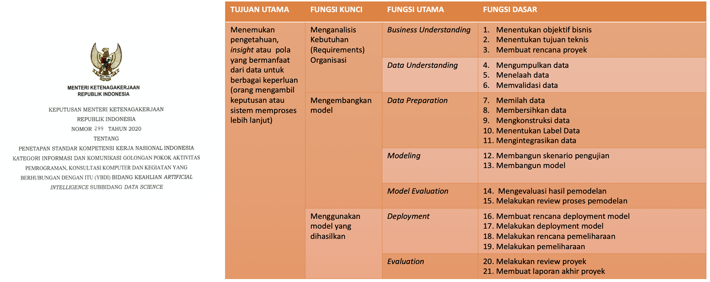

# Materi Hari 1 AI

Created: August 31, 2024 7:40 AM
Class: Silabus AI PKT
Reviewed: No

# Sistem AI Berbasis Data

- Data diolah menjadi sistem intelijen berbasis pengetahuan
- Dikembangkan dalam 2 tahap

## Tahap Pengembangan Sistem AI Berbasis Data

### Pengembangan/Pelatihan

### Penggunaan

## Tujuan Tugas/ Task yang Biasa Dikembangkan

- Descriptive: Menjelaskan keadaan bisnis saat ini melalui data historis.
- Diagnostic: Menjelaskan mengapa suatu masalah terjadi dengan melihat data historis.
- Predictive: Memproyeksikan atau memprediksi hasil masa depan berdasarkan data historis.
- Prescriptive: Menggunakan hasil analitik prediktif dan pengetahuan lain dengan menyarankan upaya terbaik di masa depan.

## Jenis Task yang Dikembangkan

- Regresi
- Classification (Klasifikasi)
- Pengelompokkan (Clustering)
- Association
- Deteksi Anomali (Anomaly Detection)
- Sistem Rekomendasi (Recommendation Systems)

## Metodologi Pengembangan

- Mayoritas proyek AI atau DS gagal. Oleh karena itu, diperlukan metodologi pengembangan
- Digunakan metode iteratif dan terstruktur untuk menyelesaikan masalah dengan menggunakan data
    
    
    
    
    

# CRISP-DM (Cross-Industry Standard Process for Data Mining)

- Pendekatan terstruktur untuk proyek data mining yang fleksibel

## Tahap-tahap

| Tahap | Deskripsi | Tujuan Utama | Contoh Kegiatan | Analisis |
| --- | --- | --- | --- | --- |
| Pemahaman Bisnis | Identifikasi masalah dan tujuan proyek | Menentukan arah dan fokus proyek | Menentukan produk yang ingin direkomendasikan | Menetapkan dasar untuk seluruh proyek. Tanpa pemahaman yang jelas tentang tujuan bisnis, proyek data mining bisa kehilangan arah. |
| Pemahaman Data | Kumpulkan data yang diperlukan dan pahami karakteristiknya | Mengenal data yang akan digunakan | Kumpulkan data transaksi pelanggan | Pemahaman data yang baik membantu dalam pemilihan metode analisis yang tepat.  |
| Persiapan Data | Siapkan data agar bersih dan siap untuk analisis | Meningkatkan kualitas data | Gabungkan dan bersihkan data dari berbagai sumber | Sering memakan waktu paling banyak. Kualitas data bisa jadi sangat berpengaruh pada akurasi model. |
| Pemodelan | Terapkan algoritma untuk membangun model dari data | Menemukan pola atau prediksi dari data | Menggunakan algoritma klasifikasi untuk analisis | Pemilihan model yang tepat tergantung pada jenis data dan tujuan proyek. Penting untuk mencoba beberapa model dan membandingkan hasilnya. |
| Evaluasi | Uji dan evaluasi kinerja model yang telah dibuat | Memastikan model memenuhi tujuan bisnis | Gunakan akurasi untuk evaluasi model | Evaluasi tentang seberapa baik model memenuhi tujuan bisnis awal. Dapat mengarah pada iterasi lebih lanjut jika diperlukan. |
| Penerapan | Terapkan model dalam lingkungan nyata untuk digunakan | Mengintegrasikan model ke dalam proses bisnis | Integrasi model ke dalam aplikasi yang sudah ada | Memerlukan perencanaan yang matang, termasuk pemeliharaan dan pemantauan kinerja model setelah diterapkan. |

Analisis:

1. **Siklus Iteratif**: CRISP-DM bukan proses linear, melainkan siklus iteratif. Setiap tahap dapat mempengaruhi tahap lainnya, dan sering kali perlu kembali ke tahap sebelumnya untuk penyempurnaan.
2. **Fleksibilitas**: Meskipun ada urutan logis, CRISP-DM cukup fleksibel untuk disesuaikan dengan kebutuhan proyek spesifik. Misalnya, beberapa proyek mungkin memerlukan lebih banyak fokus pada pemahaman data, sementara yang lain mungkin memerlukan iterasi yang lebih intensif pada tahap pemodelan.
3. **Pentingnya Pemahaman Bisnis**: Tahap pemahaman bisnis sering diabaikan, padahal sangat krusial. Tanpa pemahaman yang jelas tentang tujuan bisnis, proyek data mining bisa menghasilkan model yang akurat secara teknis tetapi tidak relevan secara bisnis.
4. **Kualitas Data**: Persiapan data sering menjadi tahap yang paling memakan waktu, tetapi investasi waktu di sini dapat sangat meningkatkan kualitas hasil akhir. Data yang bersih dan terstruktur dengan baik adalah fondasi untuk model yang akurat.
5. **Evaluasi Multi-dimensi**: Evaluasi tidak hanya tentang akurasi teknis, tetapi juga tentang nilai bisnis. Model dengan akurasi tinggi mungkin tidak selalu yang terbaik jika tidak memenuhi tujuan bisnis atau terlalu kompleks untuk diterapkan.
6. **Penerapan Berkelanjutan**: Penerapan bukan akhir dari proses. Model perlu dipantau dan diperbarui secara berkala untuk memastikan kinerjanya tetap optimal seiring berjalannya waktu dan perubahan kondisi bisnis.

Dengan memahami dan menerapkan tahap-tahap CRISP-DM ini secara efektif, praktisi data mining dapat meningkatkan peluang keberhasilan proyek mereka, menghasilkan wawasan yang berharga, dan memberikan nilai nyata bagi bisnis.

### Pemahaman Bisnis (Business Understanding)

- Pertanyaan terkait project:
    - Bagaimana keadaan saat ini? Masalah apa yang ingin diselesaikan?
    - Apa yang ingin dicapai?
    - Apakah menguntungkan untuk melakukannya? (Cost Benefit Analysis)
- Contoh:
    - Merekomendasikan produk yang sering dibeli pelanggan secara bersamaan untuk meningkatkan penjualan

### Pemahaman Data (Data Understanding)

- Kumpulkan dan eksplorasi data. Bertujuan mendapatkan gambaran utuh atas data yang meliputi karakteristik, keterkaitan, dan kualitasnya.
- Pertanyaan terkait data:
    - Apa saja data yang diperlukan?
    - Apa saja atribut atau fiturnya?
    - Apakah ada yang sudah tersedia?
    - Dari mana bisa diperoleh?
    - Berapa banyak yang diperlukan?
- Contoh:
    - Mengumpulkan data historis pembelian dan interaksi pelanggan untuk melihat pola atau tren
- Kasus Pemahaman Data:
    - Pesawat perang kembali penuh lubang peluru. Ada rencana menambahkan lapisan pelindung untuk memperkuat pesawat. Di mana mereka harus meletakkannya?
        
        
        
- Dilakukan analisa data secara eksploratif (EDA). Analisa tersebut dapat mencakup
    - Karakteristik atau deskripsi atribut data
    - Keterkaitan antar data (Korelasi)
        - Koefisien korelasi Pearson's dan Spearman
        - ANOVA
            
            
            
            
            

**Mengapa Diperlukan?**

- Solusi AI sangat bergantung pada data
- Data dari masing-masing sumber belum tentu dapat langsung dipakai karena:
    - Maksud dan tujuan data berbeda-beda
    - Keadaan asal terpisah-pisah atau justru tergabung secara ketat.
    - Tingkat kekayaan (richness) berbeda-beda. Kekayaan merujuk pada jumlah dan variasi data yang tersedia.
    - Tingkat keandalan (reliability) berbeda-beda. Keandalan merujuk pada ketepatan, kelengkapan, dan konsistensi data.

### Persiapan Data (Data Preparation)

- Memperbaiki kualitas data supaya siap dianalisis dan dilakukan pemodelan
- Mencakup:
    - Gabungkan data dari beberapa sumber berbeda
    - Sesuaikan format
    - Pemilihan dan pemilahan data. Hapus data duplikat dan tidak relevan
    - Isi nilai kosong
    - Bersihkan data dari noise
    - Tambahkan fitur
    - Terapkan transformasi data

### Pemodelan (Modeling)

- Menerapkan algoritma pada data. Data digunakan untuk melatih model.
- Tujuan algoritma
    - Pengelompokkan (Clustering)
    - Klasifikasi
    - Regresi
    - Prediksi
- Contoh:
    - Mengelompokkan pelanggan dengan kebiasaan membeli yang serupa
    - Memprediksi pelanggan mana yang kemungkinan besar berhenti berlangganan
    - Memprediksi pembelian di masa depan
- Biasanya terbagi menjadi dua tahap
    - Pelatihan
    - Pengujian

### Evaluasi (Evaluation)

- Menilai dan memeriksa kinerja model
- Metrik atau ukuran apa yang dapat digunakan?
- Apakah hasil pemodelan sudah sesuai dengan tujuan bisnis?
- Apakah model benar-benar menyelesaikan masalah?

### Penerapan (Deployment)

- Menerapkan atau mengimplementasikan model ke dalam lingkungan bisnis sehingga mudah digunakan pengguna
- Contoh:
    - Integrasi model ke dalam aplikasi atau website

# Bagian-bagian Proses Telaah Data (Data Understanding)

- Mencari tahu hubungan dan interaksi data dengan proses bisnis yang berjalan
- Menentukan sumber utama data dan cara aksesnya
- Menilai seberapa besar manfaat atau keuntungan yang dapat diperoleh dari data
- Mengidentifikasi sumber data tambahan untuk perbaikan

# Sumber Data

- Sumber Internal
    - Spreadsheet (Excel, CSV, JSON, dll.)
    - Database internal organisasi (SQL, dll.)
    - Dokumen teks internal organisasi
    - Berkas-berkas multimedia
        - Audio
        - Video
        - Gambar
- Sumber Eksternal
    - Organisasi lain
    - Situs publik
- Untuk sumber eksternal
    - Ada yang bebas digunakan kembali oleh publik
    - Ada yang harus diperoleh melalui request.
- Contoh sumber-sumber eksternal:
    - [Portal Satu Data Indonesia](https://data.go.id/)
    - [Portal Data Jakarta](https://data.jakarta.go.id/)
    - [Portal Data Bandung](http://data.bandung.go.id/)
    - [Badan Pusat Statistik](https://www.bps.go.id/)
    - [Badan Informasi Geospasial](https://tanahair.indonesia.go.id/)
    - [UCI Machine Learning repository](https://archive.ics.uci.edu/ml/index.php)
    - [Kaggle](https://www.kaggle.com/datasets)
    - [World Bank Open Data](https://data.worldbank.org/)
    - [UNICEF Data](https://data.unicef.org/)
    - [WHO Open Data](https://www.who.int/data)
    - [IBM Data Asset eXchange](https://developer.ibm.com/exchanges/data/)
    - [DBPedia](https://www.dbpedia.org/resources/)
    - [Wikidata](https://www.wikidata.org/)

# Susunan Data

- **Butir data (datum):** satuan terkecil data; satu nilai untuk satu variabel tertentu.
- **Data:** kumpulan butir data yang membawa satu kesatuan makna (mendeskripsikan satu objek) tertentu.
- **Himpunan data (dataset):** kumpulan data.
- **Metadata:** data yang menjelaskan data yang lain.

# Tipe Data

## Tipe Data Berdasarkan Struktur

### 1. Data Terstruktur (Structured Data)

- **Sifat:**
    - Model data sudah ditentukan sebelumnya.
    - Biasanya dalam format teks.
    - Elemen data dipisahkan dengan jelas karena bisa ambigu.
    - Informasinya jelas dan teratur.
    - Mudah untuk diambil dan diolah.
- **Contoh:**
    - Data tabel seperti spreadsheet.
    - Data berorientasi objek.
    - Data deret waktu (time series).

### 2. Data Tak Terstruktur (Unstructured Data)

- **Sifat:**
    - Model data tidak ditentukan sebelumnya.
    - Bisa berupa teks, gambar, suara, video, dan lainnya.
    - Elemen data tidak dipisahkan dengan jelas karena bisa ambigu.
    - Informasinya tidak teratur dan bisa membingungkan.
    - Lebih sulit untuk diekstrak atau dicari.
- **Contoh:**
    - Dokumen teks bebas.
    - Data audio.
    - Data video.

### 3. Data Semi-Terstruktur (Semi-Structured Data)

| **Tipe Data** | **Sifat** | **Contoh** |
| --- | --- | --- |
| **Data Terstruktur** | - Model data sudah ditentukan
- Format biasanya teks
- Elemen data dipisahkan jelas
- Mudah diekstrak | - Data tabel
- Data objek
- Time series |
| **Data Tak Terstruktur** | - Model data tidak ditentukan
- Format bisa teks, gambar, suara
- Elemen data tidak jelas
- Sulit diekstrak | - Dokumen teks bebas
- Data audio
- Data video |
| **Data Semi-Terstruktur** | - Tidak sepenuhnya terstruktur
- Memiliki tag atau penanda untuk memisahkan elemen
- Mengatur hierarki | - XML
- JSON |
- Memiliki elemen-elemen yang tidak sepenuhnya terstruktur seperti tabel
- Memiliki tag atau penanda untuk memisahkan elemen-elemen semantik dan mengatur hierarki.

## Tipe Data Berdasarkan Sifatnya

| **Tipe Data** | **Pengertian** | **Contoh** | **Karakteristik** |
| --- | --- | --- | --- |
| Data Dikotomi | Data yang dibagi dalam kategori yang terpisah | Suku, agama, jenis kelamin | Kategori terpisah, tidak ada nilai tengah |
| Data Diskrit | Data yang diperoleh dengan menghitung atau membilang | Jumlah anak, jumlah penduduk | Nilai tertentu, biasanya bilangan bulat |
| Data Kontinum | Data yang diperoleh dengan mengukur | Suhu, berat, kecerdasan | Dapat berupa pecahan atau desimal |

Tentu, berikut adalah penjelasan yang lebih sederhana dan mudah dipahami mengenai tipe data berdasarkan sifatnya:

### 1. Data Dikotomi

- Data yang dibagi dalam kategori yang saling terpisah atau berbeda satu sama lain.
- Contoh: Suku, agama, jenis kelamin, tingkat pendidikan.
- Karakteristik: Tidak ada nilai tengah; setiap kategori berdiri sendiri.

### 2. Data Diskrit

- Data yang diperoleh dengan cara menghitung atau membilang objek.
- Contoh: Jumlah anak dalam keluarga, jumlah penduduk di suatu daerah, jumlah kematian dalam periode tertentu.
- Karakteristik: Hanya memiliki nilai-nilai tertentu (biasanya bilangan bulat).

### 3. Data Kontinum

- Data yang diperoleh dengan cara mengukur menggunakan alat ukur dengan skala tertentu.
- Contoh: Suhu udara, berat badan, tingkat kecerdasan.
- Karakteristik: Dapat memiliki nilai apa saja dalam rentang tertentu (bisa berupa pecahan atau desimal).

## Tipe Data Berdasarkan Cara Pengumpulan

| **Tipe Data** | **Pengertian** | **Contoh** | **Karakteristik** |
| --- | --- | --- | --- |
| Data Primer | Data yang diperoleh langsung dari sumbernya | Hasil wawancara, kuesioner, survei | Bersifat orisinal, tidak melalui pihak ketiga |
| Data Sekunder | Data yang diperoleh dari sumber lain yang sudah ada | Statistik pemerintah, laporan lama | Sudah dianalisis, sering dipublikasikan oleh pihak lain |

### 1. Data Primer

- Data yang diperoleh langsung dari sumber aslinya. Peneliti sendiri yang mengumpulkan data ini.
- Contoh: Hasil wawancara, pengisian kuesioner, dan survei.
- Karakteristik: Data ini bersifat asli dan belum melalui pihak ketiga.

### 2. Data Sekunder

- Data yang diperoleh dari sumber lain yang sudah ada sebelumnya. Data ini dikumpulkan oleh orang atau lembaga lain.
- Contoh: Statistik dari lembaga pemerintah, laporan penelitian sebelumnya, dan arsip laporan.
- Karakteristik: Data ini sudah dianalisis dan sering kali dipublikasikan oleh pihak lain.

## Tipe Butir Data

| **Tipe Data** | **Sifat** | **Contoh** | **Operasi Matematika** | **Nilai Tipikal** | **Sebaran** | **Nol Sejati** |
| --- | --- | --- | --- | --- | --- | --- |
| Nominal/Kategorikal | Diskret, tidak terurut | Warna (merah, hijau, biru) | =, ≠ | Modus | Grouping | Tidak |
| Ordinal | Diskret, terurut | Nilai huruf mahasiswa | =, ≠, <, > | Modus, median | Grouping, rentang, rentang kuartil | Tidak |
| Interval | Kontinu, terurut | Suhu dalam Celcius | =, ≠, <, >, +, - | Modus, median, rata-rata aritmetik | Grouping, rentang, varians, simpangan baku | Tidak |
| Rasio | Kontinu, terurut | Panjang jalan, suhu Kelvin | =, ≠, <, >, +, -, ×, ÷ | Modus, median, rata-rata aritmetik, geometris, harmonis | Grouping, rentang, varians, simpangan baku, koefisien variasi | Ya |

## Tipe Data Berdasarkan Waktu

| Tipe Data | Pengertian | Contoh | Karakteristik |
| --- | --- | --- | --- |
| Data Cross-Section | Data pada satu titik waktu tertentu | Laporan keuangan 31 Desember 2020, data pelanggan Mei 2004 | Menggambarkan kondisi pada satu waktu |
| Data Time Series | Data yang diurutkan berdasarkan waktu | Nilai tukar dolar terhadap rupiah 2016-2020 | Menunjukkan tren atau pola perubahan |

### 1. Data Cross-Section

- Data yang diambil pada satu titik waktu tertentu.
- Contoh:
    - Laporan keuangan pada tanggal 31 Desember 2020.
    - Data pelanggan PT. Data Indah pada bulan Mei 2004.
- Karakteristik: Menggambarkan kondisi pada satu waktu tanpa memperhatikan perubahan dari waktu ke waktu.

### 2. Data Time Series (Berkala)

- Data yang dikumpulkan dan diurutkan berdasarkan waktu, menggambarkan perubahan dari waktu ke waktu.
- Contoh:
    - Perkembangan nilai tukar dolar Amerika terhadap rupiah dari tahun 2016 hingga 2020.
- Karakteristik: Menunjukkan tren atau pola perubahan dalam periode waktu tertentu.

| Tipe Data | Pengertian | Contoh | Karakteristik |
| --- | --- | --- | --- |
| Data Cross-Section | Data pada satu titik waktu tertentu | Laporan keuangan 31 Desember 2020, data pelanggan Mei 2004 | Menggambarkan kondisi pada satu waktu |
| Data Time Series | Data yang diurutkan berdasarkan waktu | Nilai tukar dolar terhadap rupiah 2016-2020 | Menunjukkan tren atau pola perubahan |

## Model-model Data

### 1. Model Data Tabular

Model data tabular adalah cara mengorganisir data dalam bentuk tabel, mirip dengan lembar kerja di Excel atau tabel dalam basis data.

- **Rekord (Record)**:
    - Setiap baris di tabel mewakili satu unit data lengkap, yang bisa disebut sebagai rekord, data point, contoh, transaksi, atau objek.
    - Misalnya, dalam tabel data mahasiswa, setiap baris bisa mewakili satu mahasiswa.
- **Atribut (Attribute)**:
    - Setiap kolom di tabel mewakili satu jenis informasi yang disebut atribut, fitur, atau dimensi.
    - Misalnya, dalam tabel data mahasiswa, kolom-kolom bisa berupa nama, umur, jurusan, dan sebagainya.
- **Jumlah Rekord dan Atribut**:
    - Tabel terdiri dari sejumlah rekord (N) dan setiap rekord memiliki sejumlah atribut (D).
    - Misalnya, tabel dengan 100 mahasiswa (rekord) dan 5 jenis informasi (atribut) seperti nama, umur, jurusan, alamat, dan nilai, memiliki nilai N=100 dan D=5.
- **Keseragaman Tipe Data**:
    - Biasanya, atribut yang sama di setiap rekord memiliki tipe data yang sama. Misalnya, kolom "umur" akan berisi angka untuk semua rekord.
- **Struktur Tabel**: Struktur tabel bisa ketat atau longgar.
    - *Struktur Ketat*: Misalnya, basis data relasional di mana tipe data dan hubungan antar tabel diatur dengan ketat.
    - *Struktur Longgar*: Misalnya, spreadsheet Excel di mana Anda bisa lebih fleksibel dalam mengatur data tanpa aturan yang ketat.
- **Bahasa Kueri**:
    - Dalam struktur yang ketat, sering kali ada bahasa kueri formal seperti SQL yang digunakan untuk mengakses dan memanipulasi data dalam tabel.
    - Ini memudahkan pencarian dan analisis data.

### 2. Model Data Graf/Jejaring

- Cara mengorganisir data yang menekankan pada hubungan antar elemen data.
    - **Simpul (Nodes)**:
        - Simpul adalah titik-titik dalam graf yang mewakili entitas atau objek.
        - Misalnya, dalam media sosial, setiap simpul bisa mewakili satu orang.
    - **Sisi/Koneksi (Edges)**:
        - Sisi adalah garis yang menghubungkan dua simpul, mewakili hubungan atau interaksi antara entitas.
        - Misalnya, dalam media sosial, sisi bisa mewakili hubungan pertemanan antara dua orang.
    - **Hubungan Antar Rekord**:
        - Mengekspresikan hubungan antar rekord (simpul) secara langsung.
        - Berguna untuk memahami bagaimana elemen-elemen data saling terhubung.
    - **Jenis Model Data Graf**:
    - **Model Data Hierarki/Pohon:** Data diatur dalam bentuk hierarki atau struktur pohon, dengan satu simpul induk dan beberapa simpul anak.
    - **Model Data Berorientasi Objek:** Mengorganisir data berdasarkan objek, yang dapat memiliki atribut dan metode, serta hubungan dengan objek lain.

### 3. Model Sekuens

- Terdiri dari catatan-catatan yang saling terhubung dalam urutan tertentu. Setiap catatan dalam data ini memiliki urutan kemunculan yang penting. Membantu kita memahami bagaimana data berubah dari waktu ke waktu.
- Struktur dari masing-masing catatan bisa jadi tidak terstruktur
- **Contoh:**
    - Data sensor suhu sepanjang waktu
    - Rekaman audio dan video
    - Data suaca
    - Jejaring sosial
    - Transaksi keuangan
- **Atribut Kontekstual dan Behavioral**:
    - **Atribut Kontekstual:** Mendefinisikan konteks dari data, seperti time stamp (cap waktu) yang menunjukkan kapan data tersebut diambil.
    - **Atribut Behavioral:** Nilai spesifik yang diperoleh dalam konteks tertentu, misalnya suhu yang dicatat pada waktu tertentu.
- **Time Series**:
    - Data sekuens dengan konteks waktu yang dicatat pada interval waktu teratur, seperti setiap detik, menit, atau hari.
    - Sangat umum digunakan dalam analisis data untuk memprediksi tren masa depan berdasarkan data historis.