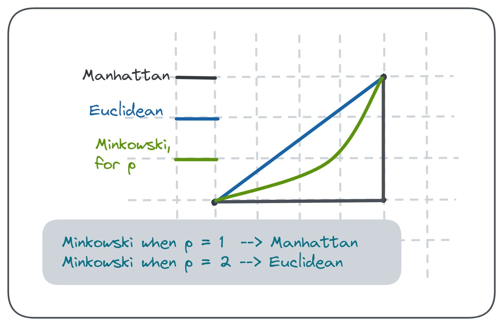
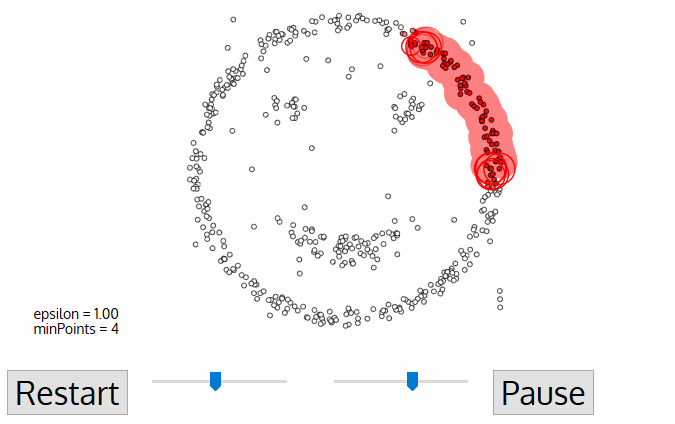
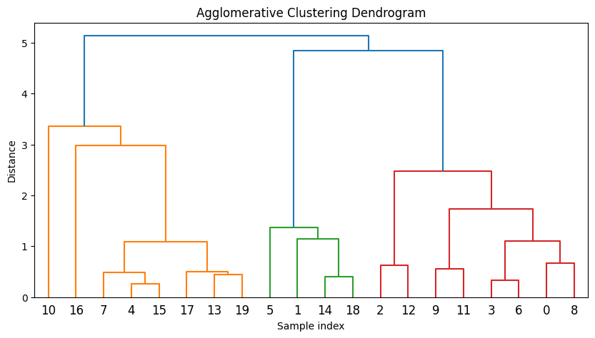
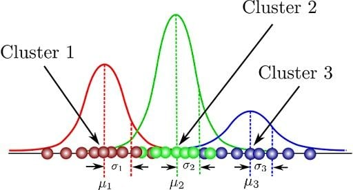

# Overview AI dan ML

AI (_artificial intelligence_) dan ML (_machine learning_) adalah bidang ilmu
yang berhubungan erat dengan data dan algoritma. Teknik dan penerapan dari AI
dan ML cukup beragam dan sudah mulai terasa manfaatnya di kehidupan
sehari-hari. ML adalah subset dari AI yang melingkupi upaya penggunaan metode
dan algoritma untuk mempelajari data dan menemukan pola-pola di dalamnya, sehingga
dapat dibuat model yang bisa digunakan untuk prediksi pada data-data baru
(generalisasi). Di dalam ML sendiri terdapat spesialisasi lanjutan yaitu
DL (_deep learning_) yang memadukan proses ekstraksi fitur ke dalam model itu
sendiri, sehingga mengurangi kebutuhan untuk melakukan ekstraksi fitur manual.

## Unsupervised

_Unsupervised learning_ adalah pendekatan ML yang melakukan proses pembelajaran
dari data yang tidak berlabel. Model belajar dari karakteristik data secara
langsung dan tanpa arahan dan pengawasan dari manusia. Model mendapatkan pola
dari kesamaan dan perbedaan antara poin-poin data dan mengelompokkan data ke
dalam kluster-kluster yang bermanfaat dalam upaya memahami data lebih dalam.

### Clustering

_Clustering_ adalah proses mengkategorikan data menjadi kluster-kluster atas
dasar kesamaan dan perbedaan poin-poin data. _Clustering_ digunakan ketika
seorang analis data ingin mendapatkan _insight_ dari data berdasarkan pola
dan pengelompokannya. Contohnya adalah untuk tujuan mencari segmentasi
pelanggan dari sebuah dataset perusahaan elektronika. Dengan _clustering_,
analis data dapat mengkategorikan pelanggan perusahaan tersebut menjadi
kelompok-kelompok yang memiliki sifat-sifat yang unik dan memungkinkan
perusahaan untuk mengambil keputusan dan strategi yang tepat untuk
menangani segmen-segmen pelanggan tersebut.

Sumber: https://www.geeksforgeeks.org/clustering-in-machine-learning/

_Clustering_ dibagi menjadi 2 tipe, yaitu "hard" _clustering_ dan "soft"
_clustering_. Perbedaan keduanya yaitu pada _hard clustering_, setiap poin
data masuk ke suatu kluster secara mutlak atau tidak sama sekali. Sedangkan
_soft clustering_ menggunakan angka probabilitas untuk menentukan keanggotaan
kluster suatu poin data. Contoh: terdapat 2 kluster K1 dan K2. Pada
_hard clustering_, poin P1 akan masuk ke K1 atau K2. Pada _soft clustering_,
sebagai contoh P1 berpeluang masuk ke K1 sebesar 0.82 dan ke K2 sebesar
0.18.

#### Penggunaan Teknik Clustering

Kegunaan _clustering_ meliputi, namun tidak terbatas pada:

- Segmentasi pasar: data aktivitas pengguna internet dimodelkan oleh pengiklan
  untuk meningkatkan efektivitas dan relevansi iklan kepada pengguna.
- Analisis keranjang pasar: data penjualan produk digunakan oleh supermarket
  untuk memberikan penawaran promosi yang lebih menarik dan juga untuk
  manajemen stok barang yang lebih _data driven_.
- Analisis jaringan sosial: digunakan dalam menyediakan rekomendasi teman dan
  konten berdasarkan karakteristik akun pengguna.
- Pencitraan medis: _clustering_ digunakan untuk menentukan daerah-daerah tubuh
  yang terkena penyakit, berdasarkan karakteristik yang tampak pada citra medis.
- Deteksi anomali: _clustering_ dapat dimanfaatkan untuk untuk mendeteksi
  adanya pencilan atau _outlier_ dalam data.
- Penyederhanaan dataset yang kompleks: _feature set_ yang rumit dapat
  disederhanakan menjadi kluster-kluster yang unik dan lebih sederhana.

#### Jenis-Jenis Algoritma Clustering

Algoritma clustering ada beberapa macam, di antaranya:

- _Centroid-based clustering_ (_partitioning methods_)
- _Density-based clustering_ (_model-based methods_)
- _Connectivity-based clustering_ (_hierarchical clustering_)
- _Distribution-based clustering_

##### Centroid-based Clustering

_Centroid-based clustering_ meng-klusterkan data berdasarkan jaraknya.
Jarak Euclidian, jarak Manhattan, atau jarak Minkowski sering digunakan
sebagai ukuran kedekatan / kejauhan poin-poin data.

Sumber: https://www.kdnuggets.com/2023/03/distance-metrics-euclidean-manhattan-minkowski-oh.html

Kelemahan dari _clustering_ tipe ini adalah perlunya untuk menentukan
jumlah kluster yang paling optimal. Hal tersebut dapat dilakukan dengan
bantuan teknik _elbow method_ maupun _silhouette method_.

Algoritma yang tergolong dalam tipe _clustering_ ini yaitu:

- K-means (menggunakan rata-rata sebagai centroid; sensitif terhadap _outlier_)
- K-medoids (menggunakan median sebagai centroid; lebih tahan _outlier_)

Sumber: https://www.analyticsvidhya.com/blog/2021/04/k-means-clustering-simplified-in-python/

##### Density-based Clustering

_Density-based clustering_ meng-klusterkan data berdasarkan kerapatan
poin-poin data. Teknik ini lebih mumpuni untuk menghandle data yang
memiliki kluster-kluster yang besar dan bentuknya tidak reguler. Selain
itu, teknik ini juga bisa menentukan jumlah kluster tanpa perlu mencarinya
secara manual.

Algoritma yang sering digunakan dalam teknik _density-based clustering_ adalah
DBSCAN.

Sumber: https://www.kdnuggets.com/2020/04/dbscan-clustering-algorithm-machine-learning.html

##### Connectivity-based Clustering

_Connectivity-based clustering_ meng-klusterkan data secara hirarkis (seperti
pohon). Kluster yang dihasilkan berwujud _dendrogram_ atau bagan pohon. Ada dua
pendekatan untuk tipe clustering ini, yaitu _divisive_ dan _agglomerative_
_clustering_. Pada _divisive clustering_, semua data pertama-tama dianggap
sebagai anggota dari satu kluster besar, lalu pada setiap tahap dipecah-pecah
menjadi kluster-kluster yang lebih kecil. Hal yang sebaliknya terjadi pada
pendekatan _agglomerative clustering_. Untuk mendapatkan kluster dengan jumlah
tertentu, dapat dilakukan pemotongan _dendrogram_ pada tingkat / level tertentu.

Sumber: https://www.geeksforgeeks.org/difference-between-agglomerative-clustering-and-divisive-clustering/

##### Distribution-based Clustering

Pada _distribution-based clustering_, poin-poin data dikelompokkan berdasarkan
tendensinya untuk masuk ke dalam salah satu distribusi statistik, contohnya
distribusi Gaussian atau distribusi normal. Teknik ini memiliki kelebihan
dibandingkan _hard clustering_ seperti K-Means, yaitu bisa menyiratkan nilai
ketidakpastian keanggotaan kluster suatu poin data dalam bentuk probabilitas.
Hal ini memungkinkan teknik ini untuk melakukan iterasi untuk meningkatkan
nilai centroid kluster menjadi lebih optimal lagi.

Sumber: https://builtin.com/articles/gaussian-mixture-model

[Referensi _notebook_ Kaggle untuk K-Means](https://www.kaggle.com/code/kushal1996/customer-segmentation-k-means-analysis)

## Supervised

_Supervised learning_ adalah pendekatan ML yang melakukan proses pembelajaran
dari data yang diberi label. Model belajar dari karakteristik data secara terarah
menggunakan label sebagai petunjuk hubungan antara input dan output model.
Model selanjutnya digunakan untuk memprediksi atau membuat keputusan berdasarkan
data baru yang masuk.

### Klasifikasi

Klasifikasi adalah proses mengkategorikan suatu data ke dalam suatu kelompok
yang bersifat kategorikal. Contohnya adalah pengklasifikasian email sebagai
spam atau non-spam. Proses klasifikasi menggunakan label dan karakteristik
data yang sudah dipelajari sebelumnya untuk memprediksi label / kategori dari
data baru.

Klasifikasi dibagi menjadi beberapa jenis, yaitu klasifikasi biner dan klasifikasi
_multiclass_. Klasifikasi biner mengelompokkan input menjadi 2 kategori saja,
sedangkan klasifikasi _multiclass_ mengelompokkan input menjadi 3 atau lebih
kategori. Contoh klasifikasi biner yaitu menentukan apakah seseorang sedang
sakit atau sehat berdasarkan gejala dan penampilan orang tersebut. Contoh
klasifikasi multiclass yaitu menentukan spesies kucing dari dataset hewan
kucing. Selain itu, terdapat juga klasifikasi multilabel dan
_imbalanced classification_. Pada klasifikasi multilabel, suatu data bisa
masuk ke dalam beberapa jenis label sekaligus. Pada _imbalanced classification_,
data baru bisa masuk ke dalam kelas mayoritas maupun minoritas.

#### Jenis-Jenis Algoritma Klasifikasi

##### Linear Classifiers

Model linear memisahkan kelas-kelas secara linear, sederhana, dan ringan secara
komputasi. Beberapa algoritma klasifikasi linear adalah:

- Logistic Regression
- Support Vector Machines dengan kernel = ‘linear’
- Single-layer Perceptron
- Stochastic Gradient Descent (SGD) Classifier

##### Non-linear Classifiers

Model non-linear memisahkan kelas-kelas secara non-linear. Dengan algoritma tipe ini,
hubungan antara input data dan output label dapat dirumuskan lebih baik. Beberapa
algoritma klasifikasi non-linear adalah:

- K-Nearest Neighbours
- Kernel SVM
- Naive Bayes
- Decision Tree Classification
- Ensemble learning classifiers
- Random Forests
- AdaBoost
- Bagging Classifier
- Voting Classifier
- ExtraTrees Classifier
- Multi-layer Artificial Neural Networks

##### Jenis-Jenis Pembelajar dalam Klasifikasi

###### Pembelajar Malas (Lazy Learners)

Tipe pembelajar malas tidak membuat model selama pelatihan. Tipeini menyimpan
data pelatihan dan menggunakannya untuk mengklasifikasikan data baru saat prediksi.
Kelebihannya adalah cepat dalam prediksi karena tidak memerlukan komputasi tambahan.
Kekurangannya adalah kurang efektif di ruang dimensi tinggi atau dengan data
pelatihan besar. Contoh: K-nearest neighbors (KNN), case-based reasoning.

###### Pembelajar Antusias (Eager Learners)

Tipe pembelajar ini membuat model dari data pelatihan dan menggunakan model ini untuk
mengklasifikasikan data baru saat prediksi. Kelebihannya adalah lebih efektif di
ruang dimensi tinggi dan dengan dataset besar. Kekurangannya adalah membutuhkan waktu pelatihan lebih lama. Contoh: decision trees, random forests, support vector machines (SVM).

##### Evaluasi Model Klasifikasi

- Akurasi Klasifikasi: Proporsi data yang diklasifikasikan dengan benar dari total data. Bisa menyesatkan pada dataset yang tidak seimbang.
- Confusion Matrix: Tabel yang menunjukkan true positives, true negatives, false positives, dan false negatives untuk setiap kelas.
- Presisi: Proporsi true positives dari total prediksi positif.
- Recall: Proporsi true positives dari total positif aktual.
- F1-Score: Rata-rata harmonis dari presisi dan recall, berguna untuk dataset tidak seimbang.
- Kurva ROC dan AUC:
  - Kurva ROC: Plot rasio true positive rate (recall) terhadap false positive rate.
  - AUC: Luas di bawah kurva ROC, mengukur kinerja keseluruhan model.
- Cross-Validation: Teknik membagi data menjadi beberapa lipatan untuk estimasi kinerja model yang lebih robust.

##### Karakteristik Klasifikasi

- Variabel Target Kategorikal: Memprediksi variabel target yang berupa kelas diskret. Contoh: klasifikasi email spam, prediksi risiko penyakit.
- Akurasi dan Tingkat Kesalahan: Diukur dengan akurasi, presisi, recall, dan F1-score.
- Kompleksitas Model: Berkisar dari model linier sederhana hingga model non-linier yang lebih kompleks.
- Overfitting dan Underfitting: Model harus dihindari dari overfitting (terlalu cocok dengan data pelatihan) dan underfitting (tidak cukup cocok dengan data pelatihan).

##### Tahapan Klasifikasi

1. Pemahaman Masalah: Identifikasi label kelas dan hubungan antara data input dan label kelas.
2. Persiapan Data: Pengumpulan, pembersihan, dan pemisahan data menjadi set pelatihan, validasi, dan pengujian.
3. Ekstraksi Fitur: Pilih fitur relevan yang mempengaruhi label atau target.
4. Pemilihan Model: Pilih model yang sesuai berdasarkan ukuran dan kompleksitas data, serta sumber daya komputasi.
5. Pelatihan Model: Sesuaikan parameter model untuk meminimalkan kesalahan antara label kelas yang diprediksi dan yang sebenarnya.
6. Evaluasi Model: Gunakan metrik seperti Log Loss, confusion matrix, presisi, recall, dan AUC-ROC.
7. Penyetelan Model: Sesuaikan parameter atau coba model berbeda jika kinerja tidak memuaskan.
8. Penerapan Model: Terapkan model untuk prediksi data baru dan aplikasi dunia nyata.

### Regresi

### Time Series Forecasting

[Referensi _notebook_ Kaggle untuk time series forecasting](https://www.kaggle.com/code/jegun19/predictive-maintenance-time-series-forecasting)

### Object Detection

## Semi-supervised

### LLM (Large Language Model)

# Referensi

1. https://cloud.google.com/discover/what-is-unsupervised-learning
2. https://www.geeksforgeeks.org/clustering-in-machine-learning/
3. https://www.geeksforgeeks.org/getting-started-with-classification/
4. https://www.geeksforgeeks.org/regression-in-machine-learning/
5. https://builtin.com/data-science/regression-machine-learning
6. https://neptune.ai/blog/performance-metrics-in-machine-learning-complete-guide
7. https://www.geeksforgeeks.org/time-series-analysis-and-forecasting/
8. https://www.ibm.com/topics/object-detection
9. https://viso.ai/deep-learning/object-detection/
10. https://www.geeksforgeeks.org/large-language-model-llm/
