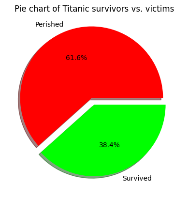
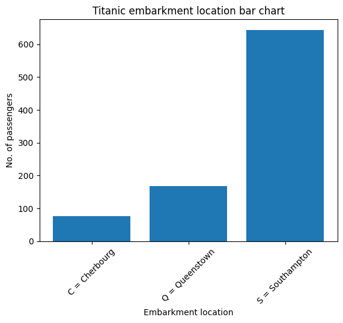
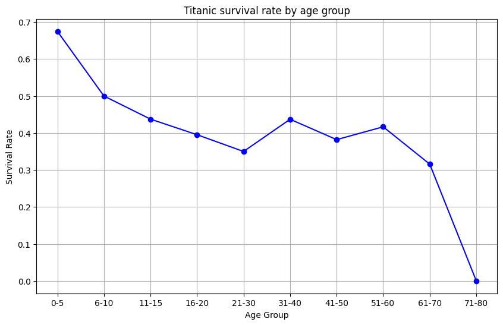
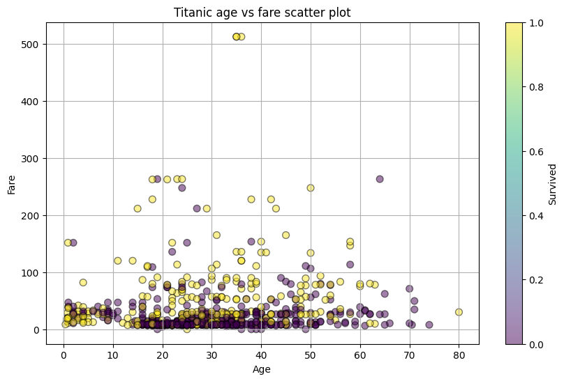
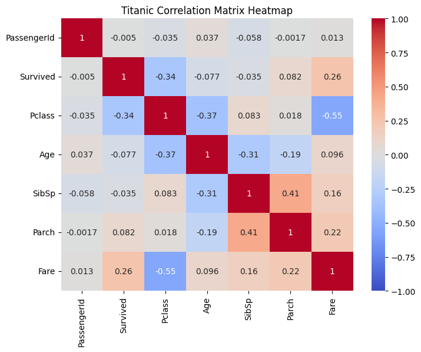

# Exploratory Data Analysis (EDA)

## Visualisasi Data

Visualisasi data adalah tindakan untuk mendapatkan gambaran mengenai data
dengan menggunakan piranti lunak.
Piranti lunak yang sering digunakan untuk melakukan visualisasi data yaitu
Python dan Jupyter Notebook.
Python memudahkan seorang analis data dalam melakukan pekerjaannya karena
sifatnya yang mudah untuk dibaca dan di-program. Selain itu, pilihan
_library_ yang luas juga menjadi daya tarik tambahan.

_Library-library_ yang seringkali digunakan untuk melakukan visualisasi
data yaitu _pandas_, _numpy_, _matplotlib_, dan _seaborn_.
_Library pandas_ menyediakan fitur _data frame_ yang bisa menampung dan
melakukan operasi-operasi kepada data yang ditampung di dalamnya.
_Library numpy_ menyediakan fitur-fitur matematika yang banyak digunakan
oleh _library library_ lainnya.
_Library matplotlib_ menyediakan fitur-fitur untuk menggambarkan grafik
dan plot data yang bisa mengubah tampilan data menjadi berbentuk visual.
_Library seaborn_ menjadi pelengkap dari _library matplotlib_ dengan
menyediakan fitur-fitur visualisasi yang lebih canggih dan indah.

Jupyter Notebook adalah piranti lunak yang menjadi _environment_ dilakukannya
proses analisis data. Di dalamnya, analis data dapat menuliskan kode dan
proses-proses analisis data. Kode dan fungsi program dipisahkan ke dalam
sel-sel yang dapat dijalankan secara independen maupun sekuensial. Salah
satu platform online yang menyediakan Jupyter Notebook adalah Google Colab.

### Dataset

Dataset adalah kumpulan data/fakta yang digunakan dalam proses analisis data.
Pada penjelasan EDA kali ini, dataset yang digunakan adalah dataset publik
yaitu Titanic Disaster. Dataset ini dapat diakses melalui tautan
[Titanic Kaggle](https://www.kaggle.com/competitions/titanic/data)
atau melalui tautan
[Titanic GitHub](https://github.com/datasciencedojo/datasets/blob/master/titanic.csv).

Pada bagian-bagian selanjutnya, akan dilakukan visualisasi data dengan beragam
teknik untuk mendapatkan _insight_ yang terkandung dalam dataset Titanic
Disaster tersebut.

### Teknik Visualisasi Data

Visualisasi dapat dilakukan dengan menggunakan teknik-teknik/metode visualisasi
seperti, tapi tidak terbatas pada, teknik-teknik di bawah ini:

- Diagram pie
- Diagram batang
- Diagram garis
- _Scatter plot_
- _Heatmap_
- _Histogram_
- _Correlation_
- _Descriptive Statistics_
- _Grouping (Pivot)_
- ANOVA

#### Diagram Pie

Diagram pie adalah diagram yang digunakan untuk menampilkan proporsi jumlah
dari setiap kategori dalam dataset dibandingkan keseluruhan data dalam bentuk
lingkaran.

Berikut adalah contoh diagram pie yang menunjukkan proporsi penumpang selamat
dan penumpang meninggal dunia.

```py
import pandas as pd
import matplotlib.pyplot as plt

# Load Titanic dataset
# Example dataset URL (replace with actual dataset path if using local file)
url = 'https://raw.githubusercontent.com/datasciencedojo/datasets/master/titanic.csv'
df = pd.read_csv(url)

survival = df['Survived'].value_counts()
plt.title('Pie chart of Titanic survivors vs. victims')
plt.pie(
    survival.values,
    labels=('Perished', 'Survived'),
    autopct='%1.1f%%',
    colors=('#FF0000', '#00FF00'),
    explode=(0.1, 0),
    shadow=True
)
plt.show()
```



#### Diagram Batang

Diagram batang adalah diagram yang digunakan untuk menampilkan dan
membandingkan data kategorikal dalam dataset dalam bentuk batangan.
Diagram batang bisa menampilkan lebih banyak kategori data dibandingkan
dengan diagram pie.

Berikut adalah contoh diagram batang yang menunjukkan jumlah penumpang
berdasarkan lokasi keberangkatan penumpang.

```py
import pandas as pd
import matplotlib.pyplot as plt
import numpy as np

# Load Titanic dataset
# Example dataset URL (replace with actual dataset path if using local file)
url = 'https://raw.githubusercontent.com/datasciencedojo/datasets/master/titanic.csv'
df = pd.read_csv(url)

embarkment = df['Embarked'].value_counts()
embarkment.sort_values(inplace=True)

x_coords = np.arange(len(embarkment))

plt.bar(
    x_coords,
    embarkment,
    tick_label=('C = Cherbourg', 'Q = Queenstown', 'S = Southampton')
)
plt.xticks(rotation=45)
plt.ylabel('No. of passengers')
plt.xlabel('Embarkment location')
plt.title('Titanic embarkment location bar chart')
plt.show()
```



#### Diagram Garis

Diagram garis adalah diagram yang digunakan untuk menampilkan kemajuan data
dalam rentang tertentu, dengan menampilkan titik-titik yang dihubungkan
dengan garis antara satu dengan yang lainnya.

Berikut adalah contoh diagram garis yang menunjukkan kemajuan/trend
tingkat keselamatan penumpang berdasarkan rentang umur.

```py
import pandas as pd
import matplotlib.pyplot as plt

# Load Titanic dataset
# Example dataset URL (replace with actual dataset path if using local file)
url = 'https://raw.githubusercontent.com/datasciencedojo/datasets/master/titanic.csv'
df = pd.read_csv(url)

# Create age bins
bins = [0, 5, 10, 15, 20, 30, 40, 50, 60, 70, 80]
labels = ['0-5', '6-10', '11-15', '16-20', '21-30', '31-40', '41-50', '51-60', '61-70', '71-80']
df['AgeGroup'] = pd.cut(df['Age'], bins=bins, labels=labels, right=False)

# Calculate survival rates by age group
age_group_survival = df.groupby('AgeGroup')['Survived'].mean()

# Plotting
plt.figure(figsize=(10, 6))
plt.plot(age_group_survival.index, age_group_survival.values, marker='o', linestyle='-', color='b')
plt.title('Titanic survival rate by age group')
plt.xlabel('Age Group')
plt.ylabel('Survival Rate')
plt.grid(True)
plt.show()
```



#### _Scatter Plot_

_Scatter plot_ adalah bagan yang bisa memberikan informasi pola maupun pencilan
dalam dataset dengan menggunakan dua komponen numerik dalam dataset.

Berikut adalah contoh _scatter plot_ yang menggambarkan poin-poin data dengan
karakteristik yaitu dua komponen numerik umur dan tarif, dengan warna
yang mewakili keselamatan penumpang tersebut.

```py
import pandas as pd
import matplotlib.pyplot as plt

# Load Titanic dataset
url = 'https://raw.githubusercontent.com/datasciencedojo/datasets/master/titanic.csv'
df = pd.read_csv(url)

# Scatter plot of Age vs Fare
plt.figure(figsize=(10, 6))
plt.scatter(df['Age'], df['Fare'], alpha=0.5, c=df['Survived'], cmap='viridis', edgecolor='k', s=50)
plt.title('Titanic age vs fare scatter plot')
plt.xlabel('Age')
plt.ylabel('Fare')
plt.colorbar(label='Survived')
plt.grid(True)
plt.show()
```



#### _Heatmap_

_Heatmap_ adalah teknik visualisasi yang menggunakan pewarnaan untuk mewakili
nilai atau kepadatan relatif data di dataset. Warna-warna yang ditampilkan
dalam _heatmap_ dapat digunakan untuk mencari kelompok-kelompok data yang
punya hubungan dan mendeteksi trend dalam data.

Berikut adalah contoh _heatmap_ yang menggambarkan hubungan korelasi antar
kolom numerik dataset.

```py
import pandas as pd
import seaborn as sns
import matplotlib.pyplot as plt

# Load Titanic dataset
url = 'https://raw.githubusercontent.com/datasciencedojo/datasets/master/titanic.csv'
df = pd.read_csv(url)
df.drop('Name', axis=1, inplace=True)
df.drop('Sex', axis=1, inplace=True)
df.drop('Cabin', axis=1, inplace=True)
df.drop('Ticket', axis=1, inplace=True)
df.drop('Embarked', axis=1, inplace=True)

# Compute the correlation matrix
corr = df.corr()

# Create a heatmap
plt.figure(figsize=(8, 6))
sns.heatmap(corr, annot=True, cmap='coolwarm', vmin=-1, vmax=1, center=0)
plt.title('Titanic Correlation Matrix Heatmap')
plt.show()
```



#### _Histogram_

_Histogram_ adalah teknik visualisasi yang digunakan untuk memahami distribusi
dari dataset. Nilai yang disampaikan oleh teknik ini adalah jumlah dari
kemunculan suatu nilai dalam data. Seringkali nilai tersebut dimasukkan
ke dalam _bin_ atau kelompok-kelompok agar bagan yang dihasilkan lebih mudah
dipahami.

Berikut adalah contoh _histogram_ yang menunjukkan frekuensi / jumlah
penumpang dengan umur pada rentang-rentang usia yang ditentukan.

```py
import pandas as pd
import matplotlib.pyplot as plt

# Load Titanic dataset
url = 'https://raw.githubusercontent.com/datasciencedojo/datasets/master/titanic.csv'
df = pd.read_csv(url)

# Extract age data
ages = df['Age'].dropna()  # Drop missing values for age

# Create histogram
plt.figure(figsize=(10, 6))
plt.hist(ages, bins=30, edgecolor='black', alpha=0.7)
plt.title('Histogram of Titanic passenger ages')
plt.xlabel('Age')
plt.ylabel('Frequency')
plt.grid(False)
plt.show()
```


#### _Correlation_

_Correlation_ adalah sebuah ukuran ketergantungan antara variabel. _Causation_
adalah hubungan sebab-akibat antara dua variabel. _Correlation_ tidak
mendeskripsikan sebab-akibat dalam dataset. Menentukan _causation_ lebih
sulit dibandingkan dengan menentukan _correlation_, karena membutuhkan
analisis lebih lanjut.

Pada _method_ `corr` pada _library pandas_, metode yang digunakan adalah
_Pearson correlation_. _Pearson correlation_ dapat menentukan korelasi linier
antara dua variabel. Nilai p-value dapat digunakan untuk menentukan signifikansi
statistik dari nilai korelasi yang didapat. Contoh: tingkat signifikansi 0,05
menandakan bahwa 95% korelasi antar variabel adalah signifikan secara statistik.

Konvensi umum mengenai nilai p-value adalah sebagai berikut:

- nilai p adalah $\le$ 0,001: kami katakan ada bukti kuat bahwa korelasinya signifikan.
- nilai p adalah $\le$ 0,05: terdapat bukti moderat bahwa korelasi tersebut signifikan.
- nilai p adalah $\le$ 0,1: ada bukti lemah bahwa korelasinya signifikan.
- nilai p adalah $\gt$ 0,1: tidak ada bukti bahwa korelasi tersebut signifikan.

Berikut adalah contoh penghitungan _correlation_ antara variabel dalam dataset.
Variabel yang dengan korelasi tertinggi adalah Parch vs. SibSp dengan nilai
korelasi 0.55.

```py
import pandas as pd
import seaborn as sns
import matplotlib.pyplot as plt

# Load Titanic dataset
url = 'https://raw.githubusercontent.com/datasciencedojo/datasets/master/titanic.csv'
df = pd.read_csv(url)

# Compute the correlation matrix
corr = df[['Age', 'Fare', 'Pclass', 'SibSp', 'Parch', 'Survived']].corr()

# Find the most correlated pair
# Drop diagonal values by setting them to NaN
corr_no_diag = corr.copy()
for i in range(len(corr_no_diag)):
    corr_no_diag.iloc[i, i] = None

# Find the maximum correlation value and its indices
max_corr = corr_no_diag.abs().max().max()
max_corr_pair = corr_no_diag.stack().idxmax()

print(f"Most correlated variables: {max_corr_pair} with a correlation of {max_corr:.2f}")

# Create regression plot for the most correlated pair
x_var, y_var = max_corr_pair

plt.figure(figsize=(10, 6))
sns.regplot(x=x_var, y=y_var, data=df, scatter_kws={'alpha':0.5}, line_kws={'color':'red'})
plt.title(f'Regression Plot of {x_var} vs {y_var}')
plt.xlabel(x_var)
plt.ylabel(y_var)
plt.grid(True)
plt.show()
```


#### _Descriptive Statistics_


#### _Grouping (Pivot)_


#### ANOVA


### Interpolasi dan Ekstrapolasi Data


## Referensi

1. https://www.ibm.com/topics/exploratory-data-analysis
2. https://www.ibm.com/topics/data-visualization
3. https://online.hbs.edu/blog/post/data-visualization-techniques